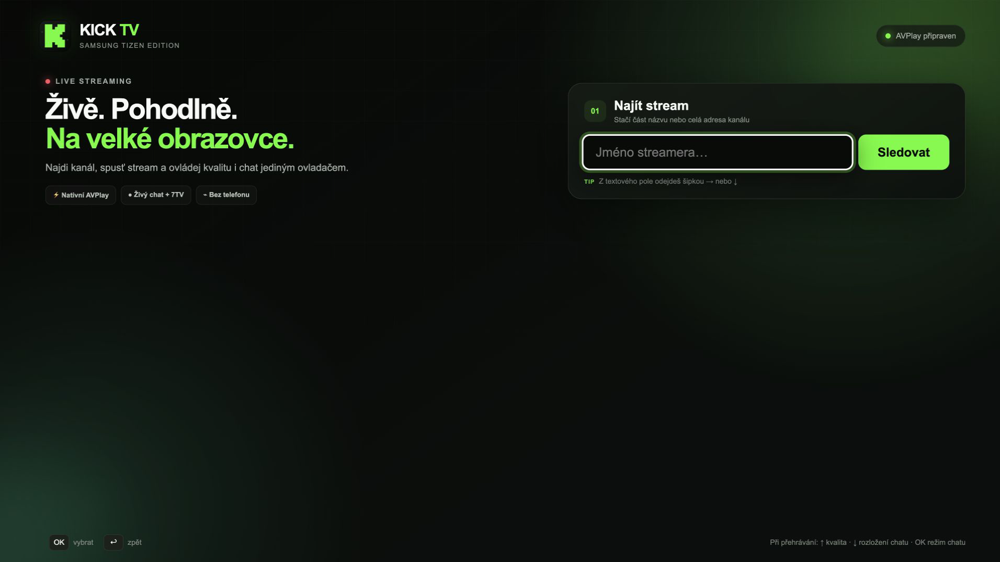
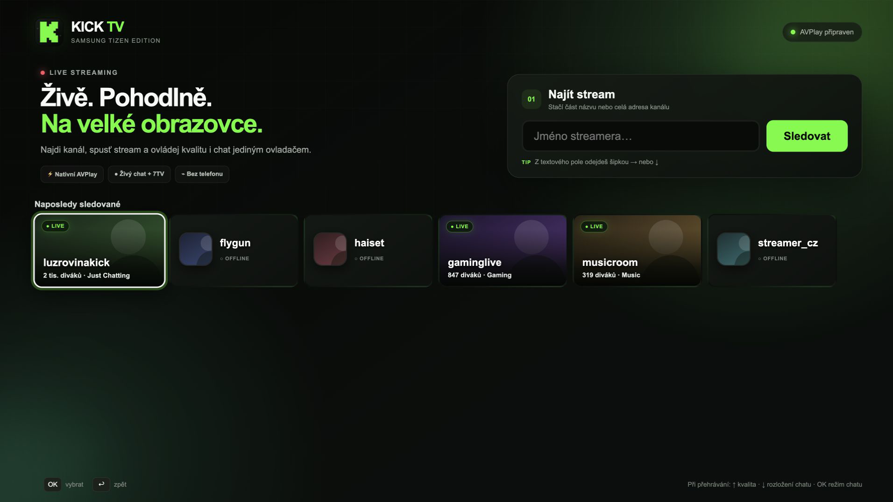
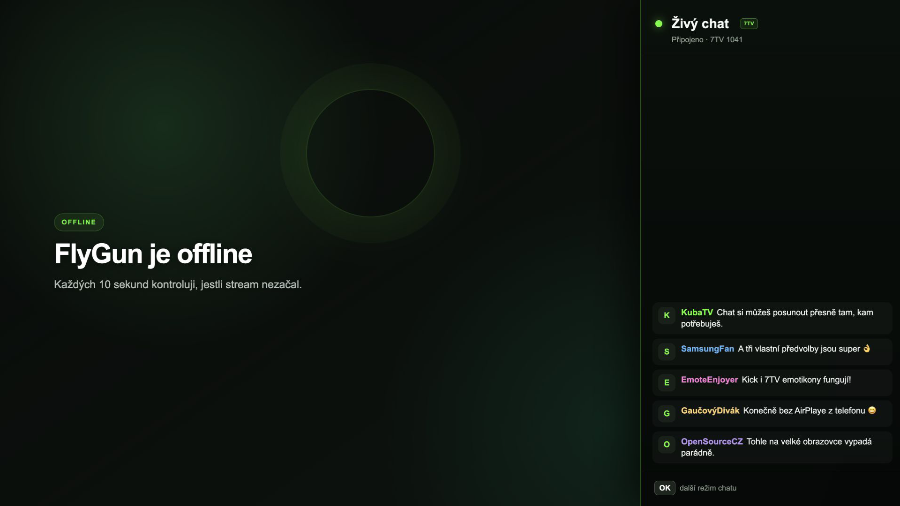
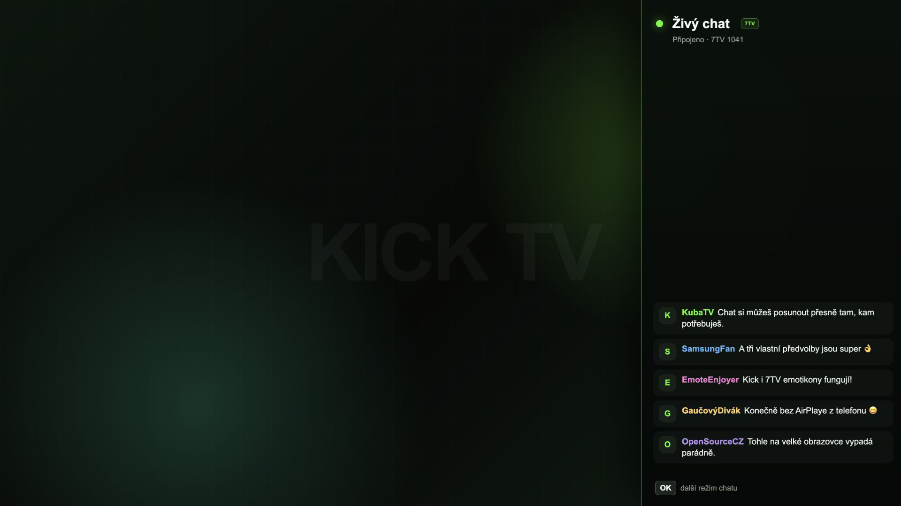
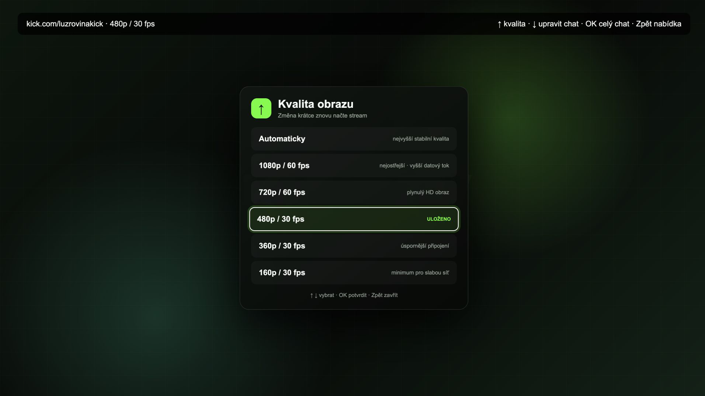
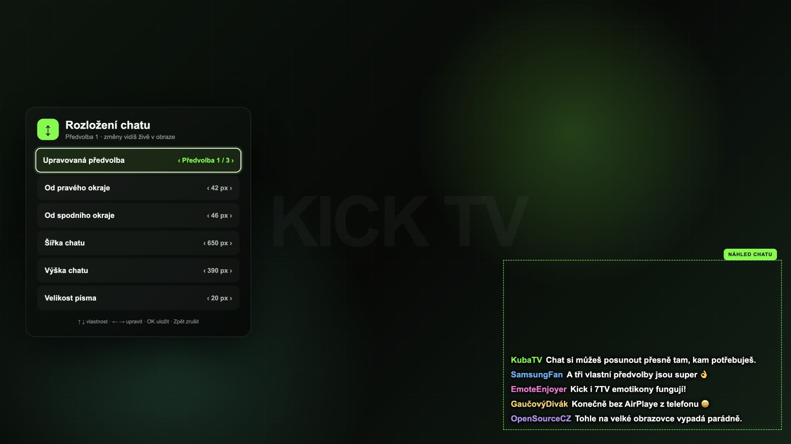

# Kick TV pro Samsung Tizen

Kick TV jsem vytvořil pro každého, kdo chce sledovat své oblíbené streamery pohodlně z gauče přímo na velké obrazovce — bez AirPlaye, telefonu nebo notebooku. Stačí vyhledat kanál, spustit stream a všechno ovládat běžným ovladačem od televize.


[Web projektu](https://corekill.github.io/kick-tv-tizen/) · [Nainstalovat přes Apps2Samsung](INSTALL.md) · [Nejnovější vydání](https://github.com/corekill/kick-tv-tizen/releases/latest)

[](https://github.com/Apps2Samsung/Apps2Samsung/releases)

## Co aplikace umí

- Stream přehrává přes nativní Samsung AVPlay a kvalitu obrazu si můžeš kdykoliv změnit.
- Nemusíš si pamatovat přesné jméno streamera. Stačí napsat jeho část a aplikace ho zkusí najít.
- Naposledy sledované kanály zůstávají v historii. Karty ukážou profilovou fotku a u živých také počet diváků a kategorii.
- Když streamer nevysílá, místo černé obrazovky uvidíš jeho jméno a rovnou otevřený chat. Aplikace každých 10 sekund zkontroluje, jestli nezačal vysílat.
- Chat umí běžné i animované Kick emotikony a k tomu globální i kanálové emotikony z 7TV.
- Chat si můžeš otevřít celý nebo ho nechat přímo v obraze. K dispozici jsou tři předvolby, u kterých si nastavíš velikost i pozici.
- Aplikace si pro každého streamera pamatuje naposledy zvolený režim chatu. Rozměry a pozice tří předvoleb přitom zůstávají společné.
- Pokud máš televizi nastavenou česky, bude česky i aplikace. Pro ostatní jazyky se automaticky přepne do angličtiny.
- Tlačítko Zpět se chová tak, jak člověk čeká: nejdřív zavře otevřenou nabídku a až potom tě vrátí na výběr streamera.
- Během sledování aplikace vypne spořič obrazovky, aby tě zbytečně nerušil.

## Jak Kick TV vypadá

<p align="center">
  
  
</p>
<p align="center">
  
  
</p>
<p align="center">
  
  
</p>

## Jak aplikaci dostat do televize

Kick TV je přímo v komunitním katalogu Apps2Samsung, takže už nemusíš ručně stahovat ani vybírat WGT soubor. Apps2Samsung stáhne aktuální verzi, podepíše ji pro tvoji televizi a rovnou ji nainstaluje.

1. Na televizi zapni **Vývojářský režim** a potom ji restartuj.
2. Stáhni a spusť [Apps2Samsung](https://github.com/Apps2Samsung/Apps2Samsung/releases).
3. V nabídce **Release** vyber **KickTV**.
4. Vyber svoji televizi a klikni na **Download & Install**.

To je celé. Kdyby se něco zaseklo nebo se KickTV v nabídce nezobrazila, podrobnější postup, záložní ruční instalaci a nejčastější řešení najdeš v [INSTALL.md](INSTALL.md).

## Co dělají tlačítka při sledování

| Tlačítko | Co udělá |
| --- | --- |
| Šipka `↑` | Nabídka kvality obrazu |
| Šipka `↓` | Nastavení rozložení chatu |
| OK | Přepíná: vypnuto → celý chat → předvolba 1 → předvolba 2 → předvolba 3 |
| Zpět | Zavře otevřenou nabídku nebo editor, potom se vrátí na výběr streamera |
| Play/Pause | Pozastaví nebo obnoví přehrávání |

## Chceš si aplikaci sestavit sám?

Stačí mít `bash`, `node`, `xmllint`, `zip` a `unzip` a spustit:

```bash
./scripts/validate.sh
./scripts/build.sh
```

Hotový balíček najdeš v `dist/KickTV.wgt`. Ani vlastní build ale neobejde podepisování pro konkrétní televizi — s tím ti může znovu pomoct Apps2Samsung.

## Na čem to funguje

- Aplikace je určená pro Samsung TV s Tizenem 4.0 a novějším.
- Opravdu jsem ji testoval na Samsung TV s Tizenem 6.0, není to jen projekt odzkoušený v emulátoru.
- Bez internetu to samozřejmě nepůjde — aplikace ho potřebuje pro stream, chat, vyhledávání i emotikony.

## Chceš podpořit další vývoj?

Kick TV dělám ve volném čase a dávám ji k dispozici zdarma. Jestli ti zpříjemnila sledování z gauče a chceš podpořit další opravy a nové funkce, můžeš mi [koupit kafe na Ko-fi](https://ko-fi.com/corekill). Není to žádná podmínka — radost mi udělá i to, když aplikaci používáš a napíšeš, když něco zlobí.

[](https://ko-fi.com/corekill)

## Ještě je dobré vědět

Kick TV je můj neoficiální komunitní projekt. Nejsem nijak spojený s Kickem, 7TV, Samsungem ani Tizenem a žádná z těchto společností aplikaci nepodporuje. Kick nebo 7TV navíc mohou svoje veřejné služby změnit, takže se občas může něco rozbít. Když se to stane, klidně [založ issue](https://github.com/corekill/kick-tv-tizen/issues/new) a zkusím se na to podívat.

Od verze 2.2 aplikace při prvním úspěšném spuštění odešle jediný anonymní signál, který zvýší celkové počítadlo instalací. Signál neobsahuje žádný identifikátor, informace o televizi, hledání, sledované kanály ani chat. Přijímač uchovává pouze výsledné celkové číslo a nevytváří záznamy o jednotlivých instalacích. [Podrobnosti o počítadle](https://corekill.github.io/kick-tv-tizen/privacy.html)

## Licence

Zdrojový kód je dostupný pod [licencí MIT](LICENSE), takže se v něm můžeš vrtat, upravovat ho a postavit si vlastní verzi. Názvy, loga a ochranné známky třetích stran ale samozřejmě zůstávají jejich vlastníkům.

---

# English

I built Kick TV for anyone who wants to watch their favorite streamers comfortably from the couch on a big screen — without AirPlay, a phone, or a laptop. Just find a channel, start the stream, and control everything with your TV remote.

[Project website](https://corekill.github.io/kick-tv-tizen/) · [Install with Apps2Samsung](INSTALL.md) · [Latest release](https://github.com/corekill/kick-tv-tizen/releases/latest)

## Features

- Native Samsung AVPlay video with selectable quality profiles.
- Streamer search by partial name with an exact-channel fallback.
- Recently watched channels with profile pictures plus viewer counts and categories for LIVE channels.
- A dedicated offline screen with the channel name, automatically opened chat, and a ten-second LIVE check that starts playback when the streamer comes online.
- Read-only live chat with animated native Kick emotes plus global and channel-specific 7TV emotes.
- Full chat panel plus three independently configurable in-picture presets.
- The last selected chat mode is remembered per streamer, while preset sizes and positions remain global.
- Czech UI for Czech TV language settings; English for every other language.
- Remote-first controls and hierarchical Back behavior.
- Screensaver suppression while playback is active.

## Easy installation

Kick TV is now included directly in the Apps2Samsung community catalog. You no longer need to download or select the WGT manually—Apps2Samsung fetches the current release, signs it for your TV, and installs it.

1. Enable **Developer Mode** on the TV and restart it.
2. Download and open [Apps2Samsung](https://github.com/Apps2Samsung/Apps2Samsung/releases).
3. Select **KickTV** from the **Release** dropdown.
4. Select your TV and click **Download & Install**.

That is it. Apps2Samsung handles the download, TV discovery, Samsung login when required, certificate generation, package signing, and installation. See [INSTALL.md](INSTALL.md) for troubleshooting and the manual fallback.

## Playback controls

| Key | Action |
| --- | --- |
| Arrow `↑` | Open video quality selection |
| Arrow `↓` | Open chat layout settings |
| OK | Cycle: off → full chat → preset 1 → preset 2 → preset 3 |
| Back | Close a menu/editor, then return to streamer selection |
| Play/Pause | Pause or resume playback |

## Build locally

Requirements: `bash`, `node`, `xmllint`, `zip`, and `unzip`.

```bash
./scripts/validate.sh
./scripts/build.sh
```

The device-neutral package is written to `dist/KickTV.wgt`. It still needs to be signed for the target TV; Apps2Samsung does this automatically during installation.

## Compatibility

- Target: Samsung Tizen TV 4.0 and newer.
- Tested on a real Samsung TV running Tizen 6.0.
- A network connection is required for streams, chat, search, and emote assets.

## Support development

Kick TV is a free project I build in my spare time. If it made watching streams from the couch a little more comfortable and you would like to support future fixes and features, you can [buy me a coffee on Ko-fi](https://ko-fi.com/corekill). There is absolutely no obligation — using the app and reporting anything that breaks also helps a lot.

[](https://ko-fi.com/corekill)

## Disclaimer

This is an unofficial community project and is not affiliated with or endorsed by Kick, 7TV, Samsung, or Tizen. Kick and 7TV may change their public web endpoints at any time. Their names, logos, and trademarks belong to their respective owners.

Starting with version 2.2, the app sends one anonymous signal after its first successful launch to increment an aggregate installation counter. It contains no identifier, TV information, searches, watched channels, or chat data. The receiver stores only the resulting total and creates no per-installation records. [Installation counter details](https://corekill.github.io/kick-tv-tizen/privacy.html#english)

## License

Application source code is available under the [MIT License](LICENSE). Third-party names, trademarks, and brand assets are not granted under that license.
